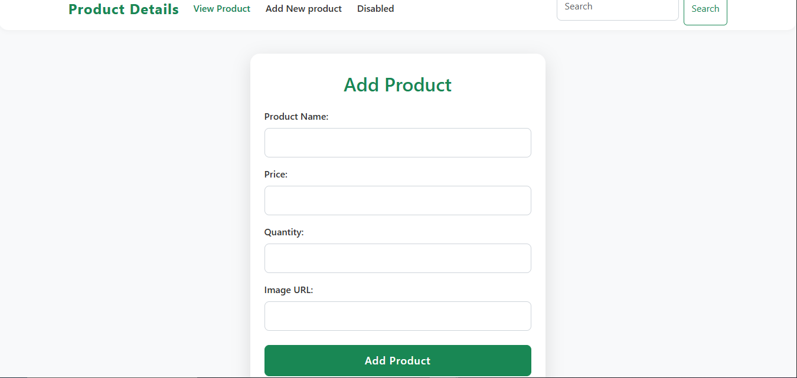

Deploy Link Here:- https://java-script-exam.vercel.app/

Output

1. Add Product



2. View Product


# JavaScript Product Management App

This is a simple product management web application built with HTML, CSS (Bootstrap), and JavaScript. It allows users to:

- Add new products with name, price, quantity, image URL, and category
- View all products in a responsive card layout
- Edit or delete products
- Search products by name
- Filter products by category
- Sort products by price (low to high, high to low)
- Increase or decrease product quantity directly from the product card
- All data is stored in the browser's localStorage

## Features

- **Add Product:** Fill out the form to add a new product. Each product includes a name, price, quantity, image URL, and category.
- **View Products:** Products are displayed as cards with all details and action buttons.
- **Edit/Delete:** Use the Edit and Delete buttons on each card to update or remove products.
- **Search:** Use the search bar to find products by name (case-insensitive).
- **Filter:** Use the category dropdown to filter products by category.
- **Sort:** Use the sort dropdown to sort products by price.
- **Quantity Controls:** Use the + and - buttons to adjust product quantity directly from the card.

## How to Use

1. Open `index.html` in your browser to view and manage products.
2. Use the form (on `index1.html`) to add new products.
3. Use the search, filter, and sort controls to find and organize products.
4. All changes are saved automatically in your browser's localStorage.

## Project Structure

```
JavaScript_Exam/
├── index.html           # Main product view page
├── index1.html          # Add new product page
├── css/
│   └── style.css        # Custom styles
├── js/
│   ├── script.js        # Add product logic
│   └── script1.js       # Product list, search, filter, sort, edit, delete
└── readme.md            # This file
```

## Requirements
- Modern web browser
- No server or database required (uses localStorage)

## Customization
- You can add more fields to the product as needed.
- Style the app further by editing `css/style.css`.

---

**Author:** Soaib-Shaikh


